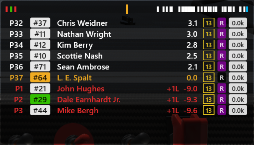
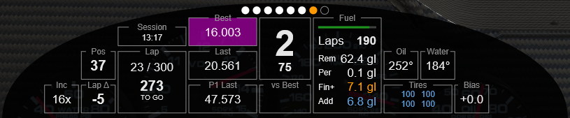
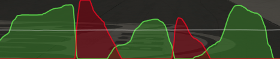
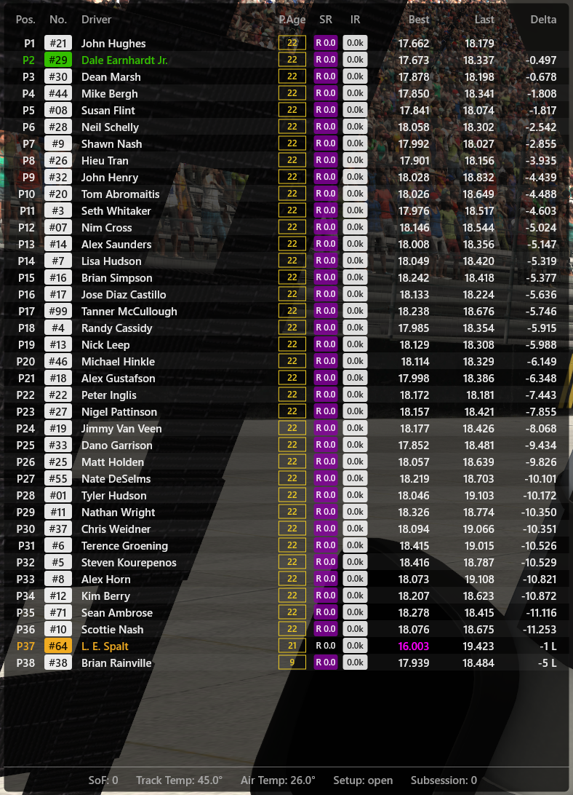

# iRon - lightweight overlays for iRacing <!-- omit in toc -->

This project provides a few lightweight overlays for iRacing. Included are: a relative display with optional minimap, a dashboard with fuel calculator, a throttle/brake input graph, and a standings display.

I created iRon for my own personal use. As such, its feature set is limited to what I considered sensible in practice given the way I use iRacing. I don't currently plan to extend it further. That said, I'm making it available in the hope it might be useful to others in the iRacing community, either for direct use or as a starting point for other homebrew overlays.

The project's code base aims to be small, easy to modify, and free of external dependencies.

# Contents <!-- omit in toc -->

- [Where to Download](#where-to-download)
- [Overlays](#overlays)
  - [*Relative*](#relative)
  - [*DDU*](#ddu)
  - [*Inputs*](#inputs)
  - [*Standings*](#standings)
  - [*Cover*](#cover)
  - [*Delta*](#delta)
- [Installing & Running](#installing--running)
- [Configuration](#configuration)
- [Building from source](#building-from-source)
- [Dependencies](#dependencies)

---

## Where to Download

The latest binary release can be found [here](https://github.com/lespalt/iRon/releases/latest).

## Overlays

### *Relative*

Like the *Relative* box in iRacing, but with additional information such as license, iRating, and laps driven since the last pit stop. You can also highlight your friends by adding their names to a buddy list.

At the top is an optional minimap (`minimap_enabled`). It can be set to either relative mode (own car fixed in the center) or absolute mode (start/finish line fixed in the center) via the `minimap_is_relative` parameter: `true` for relative mode, `false` for absolute mode.

### *DDU*

A dashboard that concentrates important pieces of information for which you would otherwise have to flip through various boxes in iRacing.

The fuel calculator shows the estimated remaining laps, remaining amount of fuel, estimated fuel used per lap, estimated _additional_ fuel required to finish the race, and the fuel amount that is scheduled to be added on the next pit stop. To compute the estimated fuel consumption, the last 4 laps under green and without pit stops are taken into account, and a 5% safety margin is added. These parameters can be customized.

### *Inputs*

Shows throttle/brake/steering in a moving graph. I find it useful to practice consistent braking.

### *Standings*

Shows the standings of the entire field, including safety rating, iRating, and number of laps since the last pit stop ("pit age"). I usually leave this off by default and switch it on during cautions. Or glimpse at it pre-race to get a sense of the competition level.

Like the "Relative" overlay, this will highlight buddies in green (Dale Jr. in the example below).

### *Cover*

No screenshot for this one, because all it is is a blank rectangle. Can be useful to cover up distracting in-game dashboards, like the one in the next-gen NASCAR.

### *Delta*

A live time-delta trace: it plots, across the lap, how much time you are gaining or losing against a reference lap. Green areas mean you are up on the reference, red means you are down. An optional *ghost* trace — a dashed line with a faint neutral fill — overlays a second reference lap for comparison, and a *section bar* along the bottom splits the lap into the sim's official timing sectors and colours each by time gained/lost. When a trace runs past the visible vertical scale its line fades out, leaving only the filled area pinned to the top/bottom edge. When you set a new best lap, the ghost's lap becomes the reference itself, so the ghost smoothly collapses onto the centre line and merges with it; an optional gold pulse of the centre line marks the personal best.

Some of this overlay's parameters take one of a fixed set of values rather than a number or colour. The most important ones:

| Parameter | Allowed values | Meaning |
|-----------|----------------|---------|
| `target` | `session_best` (default), `best` | Reference lap the live delta is measured against. `session_best` = your fastest lap in the current session; `best` = the sim's stored best lap. |
| `ghost` | `off` (default), `last`, `best`, `session_best` | Which lap to draw as the dashed ghost trace. `off` disables it; `last` = your last completed lap; `best`/`session_best` = your best lap (currently identical). |

Other notable parameters (numeric/boolean):

| Parameter | Type / range | Default | Meaning |
|-----------|--------------|---------|---------|
| `delta_range_sec` | float, min `0.05` | `1.0` | Minimum vertical scale (floor): ± this many seconds at most zoom. The scale is dynamic — it eases out lap by lap to fit the largest delta seen — but never zooms in tighter than this. |
| `range_steps` | list of floats | `["0.25","0.5","1","1.5","2","3","5","10"]` | Discrete scale steps (seconds) the dynamic scale can land on. Steps at or below `delta_range_sec` are dropped; the floor is always the lowest step. |
| `range_headroom` | float, min `0` | `0.08` | Extra slack above the peak delta before choosing a larger step (`0.08` = +8%), so the peak doesn't sit on the very top edge. |
| `rescale_speed` | float, clamped `0.1`–`10` | `1.0` | Multiplier on how fast the scale animates (`1.0` = tuned default; lower is calmer, higher snappier). Zoom-out is fast so peaks aren't clipped; zoom-in is slower. |
| `trace_resolution` | int, clamped `16`–`5000` | `300` | Number of sample buckets across the lap (higher = smoother trace, more work per frame). |
| `line_thickness` | float | `2.0` | Thickness of the delta trace line. |
| `ghost_thickness` | float | = `line_thickness` | Thickness of the ghost trace line. |
| `section_bar` | bool | `true` | Show the per-sector delta bar at the bottom. |
| `section_bar_height` | float | `22.0` | Height of the section bar, in pixels. |
| `show_section_values` | bool | `true` | Print the time gained/lost in each section on the bar. |
| `new_best_pulse` | bool | `true` | Briefly pulse the centre line when you set a new best lap (the ghost-collapse celebration). Set `false` to disable just the pulse; the ghost still collapses onto the centre. |

All `*_col` parameters (e.g. `gain_col`, `loss_col`, `ghost_col`, `ghost_fill_col`, `zero_line_col`, `new_best_pulse_col`, `section_gain_col`, …) are RGBA colours given as four numbers in the range `[0, 1]`. `ghost_fill_col` (default a faint white, `1 1 1 0.12`) is the neutral fill drawn under the ghost line; `new_best_pulse_col` (default a warm gold, `1 0.85 0.35 0.55`) is the colour the centre line pulses to on a new best.

---

## Installing & Running

The app does not require installation. Just copy the executable to a folder of your choice. Make sure the folder is not write protected, as iRon will attempt to save its configuration file in the working directory.

To use it, simply run the executable. It doesn't matter whether you do this before or after launching iRacing. A console window will pop up, indicating that iRon is running. Once you're in the car in iRacing, the overlays should show up, and you can configure things to your liking. I recommend running iRacing in borderless window mode. Overlays *might* work in other modes as well, but I haven't tested it.

---

## Configuration

To place and resize the overlays, press ALT-j. This will enter a mode in which you can move overlays around with the mouse and resize them by dragging their bottom-right corner. Press ALT-j again to go back to normal mode.

Overlays can be switched on and off at runtime using the hotkeys displayed during startup. All hotkeys are configurable.

Certain aspects of the overlays, such as colors, font types, sizes etc. can be customized. To do that, open the file **config.json** that iRon created and experiment by editing the (hopefully mostly self-explanatory) parameters. You can do that while the app is running -- the changes will take effect immediately whenever the file is saved.

Most parameters are self-explanatory: colours are RGBA values given as four numbers in the range `[0, 1]`, sizes are in pixels, and `true`/`false` parameters simply switch a feature on or off. A few parameters instead accept one of a fixed set of named values -- where that is the case, the allowed values are documented in the corresponding overlay's section above (for example, the [*Delta*](#delta) overlay's `target` and `ghost`).

_Note that currently, the config file will be created only after the overlays have been "touched" for the first time, usually by dragging or resizing them._

---

## Building from source

This app is built with Visual Studio 2022. The free version should suffice, though I haven't verified it. The project/solution files should work out of the box. Depending on your Visual Studio setup, you may need to install additional prerequisites (static libs) needed to build DirectX applications.

---

## Dependencies

There are no runtime dependencies other than standard Windows components like DirectX.  Those should already be present on most if not all systems that can run iRacing.

Build dependencies (most notably the iRacing SDK and picojson) are kept to a minimum and are included in the repository.

